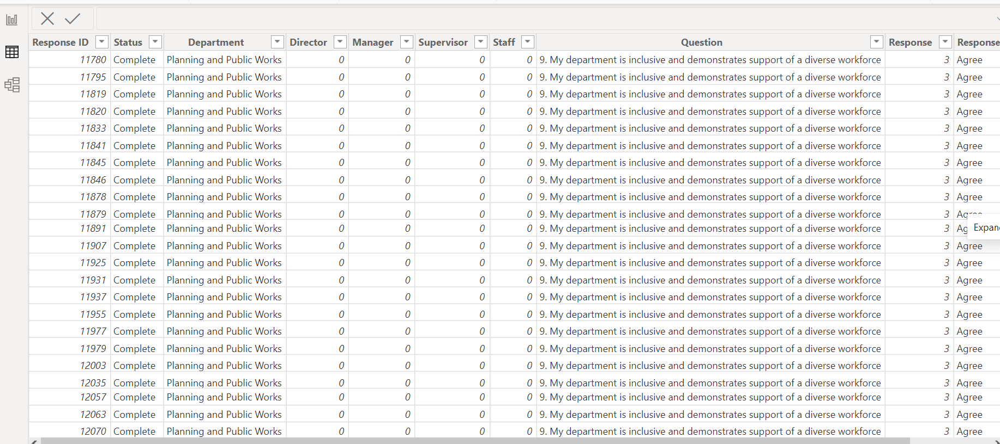
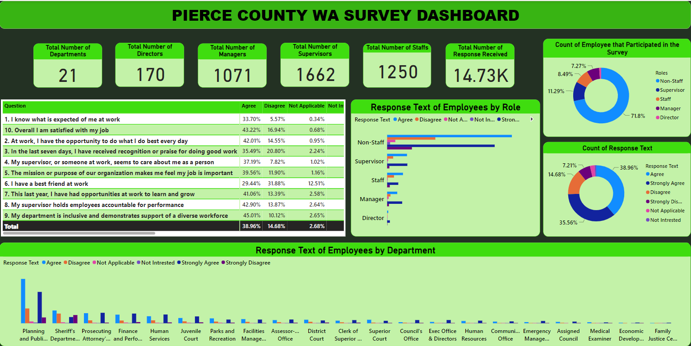
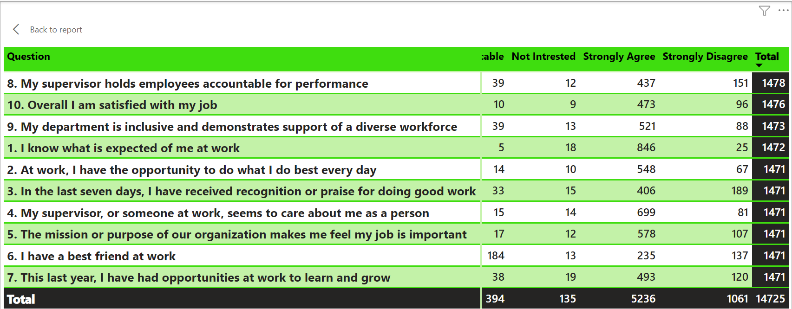
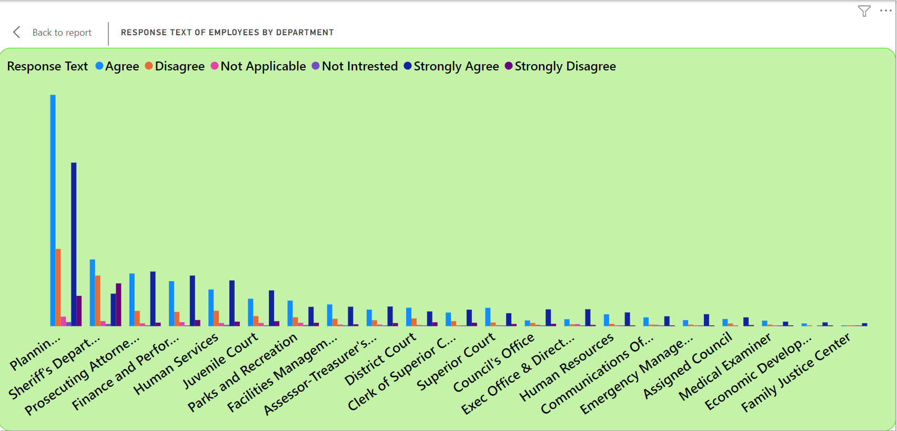
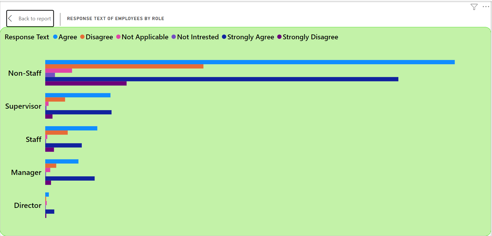
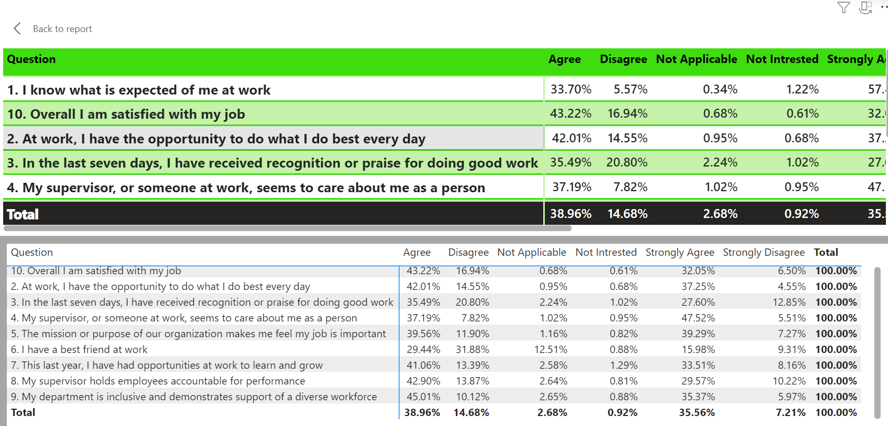

# Employee-Survey-Analysis

---

## INTRODUCTION:
The Employee Survey Responses are actual responses from an employee engagement survey conducted by **Pierce County WA** and completed voluntarily by government employees. 

## PROBLEM STATEMENT:
- Which survey questions did respondents agree with or disagree with most?
- Do you see any patterns or trends by department or role?
- As an employer, what steps might you take to improve employee satisfaction based on the survey results?

## SKILL DEMONSTRATED:
- Data cleaning
- Tooltips
- Conditional columns

## DATA SOURCING:
This dataset was provided by Digitaley Drive as my project as a scholarship student. The dataset is a Single table and contains 14,725 records. The total number of fields is 10.

## DATA TRANSFORMATION:
The dataset underwent meticulous cleaning through a series of steps, including replacing blank spaces in response text with "Not Interested",  replacing blank spaces in the role column with “ Non-Staff”, establishing a conditional column for roles, and ensuring accurate data types.

## DATA MODELING: 
No data model was implemented as there is only a single table or sheet present.

## ANALYSIS AND VISUALIZATION

In the construction of this visualization, I employed various canvases. Following an in-depth analysis, I discovered noteworthy findings: A total of 21 departments, 170 directors, 1,250 staff members, 1,662 supervisors, and 1,071 managers.

## CONCLUSION AND RECOMMENDATION:

The question that received the highest number of responses is “My supervisors hold employees accountable for performance”.

A predominant trend observed is that a significant number of employees in each department either agree or strongly agree with the survey questions.

A notable majority of survey participants belong to the non-staff category among the employees.

All questions received overwhelmingly positive feedback, with the exception of the question "I have a best friend at work," which generated a comparatively negative response. 
## Employer steps to improve employee satisfaction:
- Ensure that employees have a clear understanding of their roles and responsibilities. Provide clear job descriptions and communicate expectations effectively
- Establish a recognition program to acknowledge and reward employees for their good work. 
- Invest in training and development programs to offer employees opportunities to learn and grow in their roles. This could include workshops, seminars, or online courses.
- Encourage supervisors to build strong relationships with their team members. 
- Reinforce the organization's mission and purpose to help employees understand the significance of their roles in contributing to the overall goals of the company.
- Encourage open communication and create an environment where all employees feel valued.
Accountability for Performance:
- Ensure that supervisors hold employees accountable for their performance while providing constructive feedback.
- Promote team-building activities and initiatives that encourage positive relationships among colleagues. Foster a collaborative and friendly work culture.
- Address any specific concerns or issues raised in the survey related to overall job satisfaction by conducting follow-up interviews or focus group discussions to gather more detailed feedback.
- Implement regular surveys to continuously gauge employee satisfaction and identify areas for improvement. Actively involve employees in the decision-making process and address concerns promptly.

